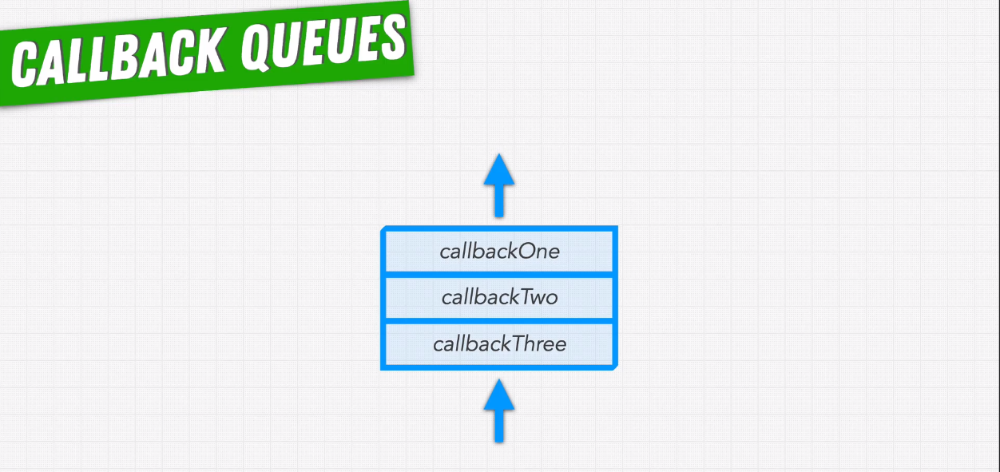
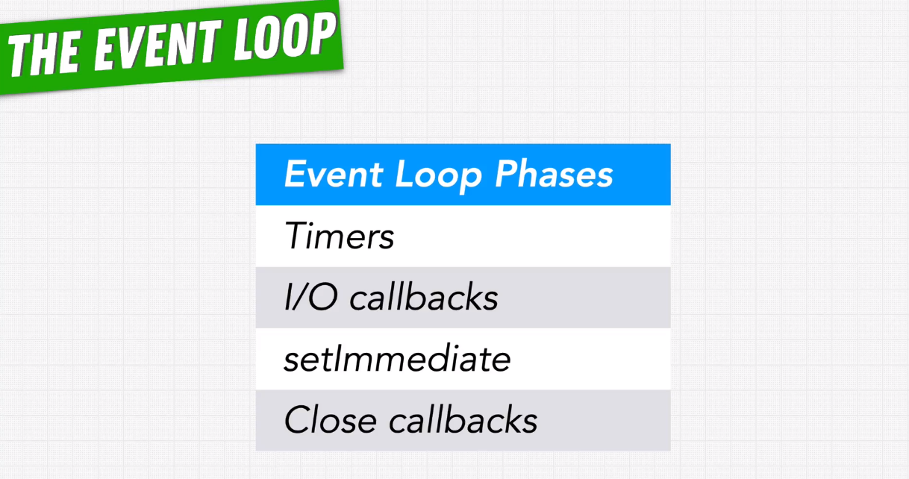
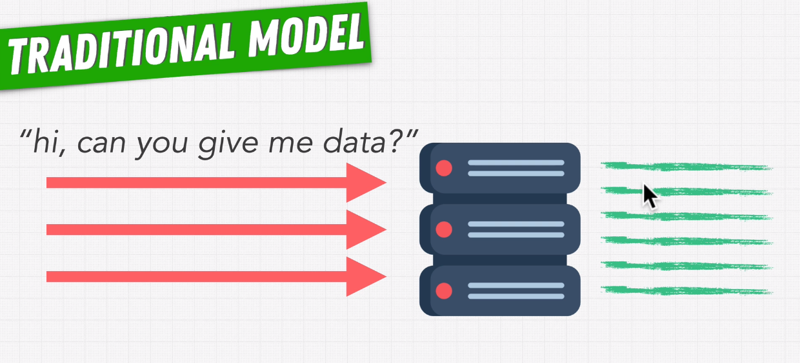

# Explain Node.js Architecture

Topics:  

* What is Node.js?
* Synchronous & Asynchronous Code Execution
* Blocking & Non-Blocking Functions
* Is JavaScript Asynchronous?
* Multi-Threading, Processes & Threads
* Is Node.js Multi-Threaded?
* The Event Loop
* Global Execution Context (GEC) behavior
* Callback Queues
* Phases of the Event Loop
* Comparing Node.js With PHP & Python
* What Is Node.js Best At?

---

## What is Node.js?

From the official website of [Node.js](https://nodejs.org/en):  
> Node.js is a free, open-source, cross-platform JavaScript runtime environment
> that lets developers create servers, web apps, command line tools and scripts.
> Node.js is not a programming language or a framework.

Using Node.js we can run JavaScript outside of the browser.

Node.js = V8 + Node.js APIs (Core Modules) + Node.js Bindings + libuv

**What Node.js includes**  


Things that are not part of the "V8 JavaScript Engine" like:  

* File I/O operations (read/write etc)
* Network operations
* Database operations

etc. are handled by "libuv".

**V8**  
JavaScript Engine developed by Google for Chrome browser.
JavaScript Engine is required to execute JavaScript code.

**libuv**  
libuv is a multi-platform C library that provides support for asynchronous I/O operations based on event loops.

**JavaScript Runtime**  
An environment that allows to run JavaScript.

---

## Synchronous & Asynchronous Code Execution

In programming "Synchronous" means - the code that runs line by line or in sequence.  
"Asynchronous" is the opposite of "Synchronous", it means - the code that does not run line by line.

For most tasks in our programs, its possible for our computer/server to work on the multiple tasks at the same time, when one piece of code is still executing, our program moves onto the next piece of code, this is "Asynchronous" code execution.

Often times in your program, there will be some "Asynchronous" functions. These "Asynchronous" functions run in the background while your JavaScript has already moved onto the next line of code.

---

## Blocking & Non-Blocking Functions

**Blocking Function**  

* Executes synchronously
* So blocks the execution of the next line until it is finished

Example
`JSON.stringify({ food: 'love' });`

**Non-Blocking Function**  

* Executes asynchronously, runs in the background
* So does not block the execution of the next line

Example
`setTimeout(function() { // do something }, 5000);`

**When to use Non-Blocking Function?**  
Operations/processes which are dependent on third party/external services
or other devices like hard disk, camera etc. may take longer to finish,
or CPU intensive operations that may take longer than expected.
We should handle such operations/processes using Non-Blocking Functions
so that Node.js can continue rest of the operations without blocking the main thread.

Some of the use cases are:

* file operations
* database operations
* using 3rd party services via API calls
* any processes that are long running and can be put into the background
* using camera to take pictures/videos or scan QR code
etc.

---

## Is JavaScript Asynchronous?

JavaScript itself is a Synchronous language.
It executes code line by line, in sequence, synchronously.

But it can be manipulated to behave like an Asynchronous language.
We can write Asynchronous code, where we are able to execute
callback function in the future when some event occurs.

Browser and Node.js allows us to write Asynchronous code.

> JavaScript itself is a Synchronous language,  
> but it is the JavaScript Runtime Environment (Browser/Node.js) that allows us  
> to write Asynchronous code using its APIs.

**Asynchronous code examples > Browser side:**  

#1 Call an API asynchronously when a form is submitted  

```javascript
const form = document.querySelector('#loginForm');

form.addEventListener('submit', async (event) => {
  event.preventDefault(); // prevent default browser form submission

  const formData = new FormData(form);

  const payload = {
    email: formData.get('email'),
    password: formData.get('password'),
  };

  try {
    const response = await fetch('/api/v1/auth/sign-in', {
      method: 'POST',
      headers: { 'Content-Type': 'application/json' },
      body: JSON.stringify(payload),
    });

    const data = await response.json();

    if (!response.ok) {
        throw new Error(data.message);
    }

    console.log('Logged in successfully:', data);
    window.location.href = '/dashboard'; // redirect on success
  } catch (error) {
    console.error('Login failed:', error.message);
    document.querySelector('#errorMsg').textContent = error.message;
  }
});
```

#2 Call an API to update likes when "Like" button is clicked  

```javascript
const likeButton = document.querySelector('#likeBtn');
const likeCount = document.querySelector('#likeCount');

likeButton.addEventListener('click', async () => {
  const postId = likeButton.dataset.postId; // <button data-post-id="123">

  // Optimistic UI update — update count immediately before API call
  likeButton.disabled = true;
  likeCount.textContent = parseInt(likeCount.textContent) + 1;

  try {
    const response = await fetch(`/api/v1/posts/${postId}/like`, {
      method: 'POST',
      headers: { 'Content-Type': 'application/json' },
    });

    const data = await response.json();

    if (!response.ok) {
        throw new Error(data.message);
    }

    // Update with actual count from server
    likeCount.textContent = data.likes;
  } catch (error) {
    // Revert optimistic update on failure
    likeCount.textContent = parseInt(likeCount.textContent) - 1;
    console.error('Failed to like post:', error.message);
  } finally {
    likeButton.disabled = false;
  }
});
```

#3 Do something at a specific interval, lets say every 5 mins  

```javascript
const FIVE_MINUTES = 5 * 60 * 1000;

async function syncNotifications() {
  try {
    const response = await fetch('/api/v1/notifications/unread');
    const data = await response.json();

    const badge = document.querySelector('#notificationBadge');
    badge.textContent = data.count;
    badge.style.display = data.count > 0 ? 'block' : 'none';

    console.log(`Notifications synced at ${new Date().toLocaleTimeString()}`);
  } catch (error) {
    console.error('Failed to sync notifications:', error.message);
  }
}

// Run immediately on page load
syncNotifications();

// Then repeat every 5 minutes
const intervalId = setInterval(syncNotifications, FIVE_MINUTES);

// Clear interval when user navigates away — avoid memory leaks
window.addEventListener('beforeunload', () => {
  clearInterval(intervalId);
});
```

#4 Do something after a specified time  

```javascript
const toast = document.querySelector('#successToast');

function showToast(message) {
  toast.textContent = message;
  toast.classList.add('visible');

  // Automatically hide toast after 3 seconds
  const timeoutId = setTimeout(() => {
    toast.classList.remove('visible');
  }, 3000);

  // Allow manual dismissal — clears timeout so it doesn't run twice
  toast.addEventListener('click', () => {
    clearTimeout(timeoutId);
    toast.classList.remove('visible');
  }, { once: true }); // once: true removes listener after first click
}

showToast('Profile updated successfully!');
```

#5 Call an API to get data and then display it  

```javascript
async function loadUserProfile(userId) {
  const container = document.querySelector('#profileContainer');

  // Show loading state
  container.innerHTML = '<p>Loading...</p>';

  try {
    const response = await fetch(`/api/v1/users/${userId}`);
    const data = await response.json();

    if (!response.ok) throw new Error(data.message);

    // Render user profile
    container.innerHTML = `
      <div class="profile">
        <h2>${data.user.firstName} ${data.user.lastName}</h2>
        <p>Email: ${data.user.email}</p>
        <p>Member since: ${new Date(data.user.createdAt).toLocaleDateString()}</p>
      </div>
    `;

  } catch (error) {
    container.innerHTML = `<p class="error">Failed to load profile: ${error.message}</p>`;
  }
}

// Call on page load
loadUserProfile(123);
```

Asynchronous code examples > Node.js/Server side:  

#1 File I/O, do something once file I/O is finished  

```javascript
import fs from 'fs';
import path from 'path';

const logsPath = path.join(process.cwd(), 'logs', 'app.log');

// Read file asynchronously — callback fires when read is complete
fs.readFile(logsPath, 'utf8', (err, data) => {
  if (err) {
    console.error('Failed to read log file:', err.message);
    return;
  }

  const lines = data.split('\n');
  console.log(`Log file has ${lines.length} lines`);

  // Process the data — write a summary file
  const summary = `Total log lines: ${lines.length}\nProcessed at: ${new Date().toISOString()}`;

  // Write summary asynchronously — nested callback fires when write is complete
  fs.writeFile('logs/summary.txt', summary, 'utf8', (writeErr) => {
    if (writeErr) {
      console.error('Failed to write summary:', writeErr.message);
      return;
    }
    console.log('Summary written successfully');
  });
});

console.log('Reading log file...'); // runs immediately — does not wait for readFile
```

#2 Process related events like 'uncaughtException', 'unhandledRejection', 'exit' etc.  

```javascript
import mongoose from 'mongoose';

// Fires when a synchronous error is thrown and not caught anywhere
process.on('uncaughtException', (err) => {
  console.error('Uncaught Exception — shutting down:', err.message);
  process.exit(1); // always exit — process may be in unstable state
});

// Fires when a Promise is rejected with no .catch() handler
process.on('unhandledRejection', (reason, promise) => {
  console.error('Unhandled Rejection at:', promise);
  console.error('Reason:', reason);
  server.close(() => process.exit(1)); // graceful shutdown
});

// Fires just before the process exits — cleanup last chance
// Note: cannot prevent exit here — only synchronous code runs
process.on('exit', (code) => {
  console.log(`Process exiting with code: ${code}`);
  // ✅ synchronous cleanup only
  // ❌ async operations (await, callbacks) will NOT complete here
});

// Fires when Ctrl+C is pressed in terminal
process.on('SIGINT', async () => {
  console.log('SIGINT received — shutting down gracefully');
  await mongoose.connection.close();
  server.close(() => process.exit(0));
});

// Fires when process manager (Docker, PM2) requests shutdown
process.on('SIGTERM', async () => {
  console.log('SIGTERM received — shutting down gracefully');
  await mongoose.connection.close();
  server.close(() => process.exit(0));
});
```

#3 Custom event & event handler  

```javascript
import { EventEmitter } from 'events';

// Create a custom event emitter for the order processing system
class OrderService extends EventEmitter {
  async placeOrder(orderData) {
    console.log('Placing order:', orderData.id);

    // Simulate async order processing
    await new Promise(resolve => setTimeout(resolve, 100));

    // Emit events at different stages — listeners handle side effects
    this.emit('order:placed', orderData);

    // Simulate payment processing
    const paymentSuccess = orderData.amount < 10000; // assume > 10000 fails

    if (paymentSuccess) {
      this.emit('order:paid', { ...orderData, paidAt: new Date() });
    } else {
      this.emit('order:failed', { ...orderData, reason: 'Payment declined' });
    }
  }
}

const orderService = new OrderService();

// Register event handlers — each handles one specific concern
orderService.on('order:placed', (order) => {
  console.log(`Order ${order.id} placed — sending confirmation email`);
  // sendEmail(order.customerEmail, 'Order Confirmation', ...)
});

orderService.on('order:paid', (order) => {
  console.log(`Order ${order.id} paid — notifying warehouse`);
  // notifyWarehouse(order)
});

orderService.on('order:failed', (order) => {
  console.error(`Order ${order.id} failed — reason: ${order.reason}`);
  // sendEmail(order.customerEmail, 'Payment Failed', ...)
});

// once() — fires only the first time the event is emitted, then removes itself
orderService.once('order:placed', () => {
  console.log('First order of the day received!');
});

// Trigger the flow
orderService.placeOrder({ id: 'ORD-001', amount: 500, customerEmail: 'user@example.com' });
orderService.placeOrder({ id: 'ORD-002', amount: 15000, customerEmail: 'user2@example.com' });
```

NOTE: Promise/fetch are part of JavaScript since ES6, using it we can write Asynchronous code.

---

## Multi-Threading, Processes & Threads

**Processes**  
Processes are containers, that contain your Code.  
This Code lives in the memory of the Process.

**Processes & Threads**  
Processes also contain one or more Threads.  
Threads share memory and code but not call stacks, they have their own call stack.  
Threads execute side-by-side and independently, they don't interfere with each other.

So using multiple threads, processes can execute their code asynchronously.

When a CPU has multiple chores, each chore can execute one thread. So if a CPU has 4 chores, then it can execute 4 threads simultaneously.


> JavaScript is a single threaded programming language.

---

## Is Node.js Multi-Threaded?

Node.js = V8 + Node.js APIs (Core Modules) + Node.js Bindings + libuv

V8 is a JavaScript Engine, it executes JavaScript code and it has a single thread.
JavaScript is a single threaded language.

libuv is a multi-platform C library that provides support  
for asynchronous I/O operations based on event loops.  
Inside libuv we have thread pool/collection of threads.  
libuv is written in C/C++ which does have threads.

**The Main Thread**  
JavaScript is a single threaded programming language.
So if it is not threads then how does Node.js execute code Asynchronously.

In Node.js we have one main thread which runs

* the V8 JavaScript engine
* Node.js APIs & Node.js Bindings
* libuv (event loop)

**libuv & Thread Pool**  
libuv handles Asynchronous I/O

* file system operations
* network operations
etc.

Inside libuv we have thread pool/collection of threads.
libuv is written in C/C++ which does have threads.


**libuv & OS/Kernel**  

Note that, not all the asynchronous functions are executed in the thread pool.
Wherever possible libuv uses the operating system kernel directly instead of threads.


**Summary of JavaScript Code Execution**  

JavaScript Application  
* Synchronous Code  
    * Main Thread takes care of it.  
    * Executes line by line until call stack is empty (except GEC).  
    * DONE  
* Asynchronous Code  
    * libuv takes care of it via Event Loop.  
    * Offloads the task to one of the threads in the Thread Pool OR OS Kernel (whenever possible).  
    * Runs in the background.  
    * Once done, corresponding callback is pushed into the Callback Queue/Microtask Queue.  
    * At the end this callback is picked by Event Loop for execution once call stack is empty (except GEC).  
    * Executes until Callback Queue/Microtask Queue becomes empty.  
    * DONE  

**The Event Loop**  
Using Event Loop code libuv runs Asynchronous function and
when it is finished it executes the corresponding callback function.

In Node.js whenever we call an Asynchronous function from JavaScript
it is put on the Event Loop.

JavaScript executes on the main thread and any Asynchronous functions are put on the Event Loop.

As a Node.js developer we never have to worry about managing multiple threads.
It allows developer to focus more on the application, it also simplifies how you write code.

---

## The Event Loop

**What is Event Loop?**  
The Event Loop is the most important part of the Node.js runtime.
It is responsible for handling all the callback functions in your program.
These callback functions allows Node.js to execute code asynchronously.

Its the Event Loop that allows Node.js program to do multiple things all at once
even though JavaScript is a single threaded language.

The Event Loop is a piece of code in libuv that processes Asynchronous events.

Psuedocode for the Event Loop may look like below:  

```
// While application is still running and the call stack is empty.
while (appIsRunning && callStackIsEmpty) {
    // First process the Micro Task Queue/Priority Queue.
    while (microTaskQueueIsNotEmpty) {
        // Process all the callbacks ready for execution from the Micro Task Queue OR the Priority Queue.
    }

    // Then process the Task Queue/Macro Task Queue/Callback Queue as per the following order/phases.
    // timers -> pending callbacks -> idle, prepare -> poll -> check -> close callbacks
    while (timersQueueIsNotEmpty) {
        // Process callbacks ready for execution from the timers queue.
    }

    while (pendingCallbacksQueueIsNotEmpty) {
        // Process callbacks ready for execution from the pending callbacks queue.
    }

    while (idlePrepareQueueIsNotEmpty) {
        // Process callbacks ready for execution from the idle, prepare queue.
    }

    while (pollQueueIsNotEmpty) {
        // Process callbacks ready for execution from the poll queue.
    }

    while (checkQueueIsNotEmpty) {
        // Process callbacks ready for execution from the check queue.
    }

    while (closeCallbacksQueueIsNotEmpty) {
        // Process callbacks ready for execution from the close callbacks queue.
    }
}
```

---

## Global Execution Context (GEC) behavior

The Global Execution Context remains on the call stack throughout the entire lifecycle of your Node.js script. When we say "call stack is empty" in the context of the Event Loop, we mean:  

* Empty = Only the Global Execution Context remains  
* All other function execution contexts have been popped off  
* No synchronous code is currently executing  

---

## Callback Queues

**What is a Callback Queue?**  
When ready for execution, callbacks are put on the callback queue.

Callback queue keeps track of which callbacks are ready to be executed.

Callback queue is a FIFO queue, that means the functions added first will be executed first.

Other terms for the callback queue are "Event Queue"/"Message Queue"/"Task Queue".

**Callback Queue (FIFO)**  


---

## Phases of the Event Loop

**4 Main Phases of the Event Loop**  
There is no one callback queue, there are multiple callback queues.
Each one handles a different phase of the Event Loop.

There are 4 main phases of the Event Loop:

* Timers
* I/O Callbacks/Pending Callbacks
* setImmediate/Check
* Close Callbacks



Each of these phases is responsible for a different category of operations that the Event Loop processes.  
Each of these phases have their own queue of callbacks that are executed during that phase.  

There are 3 types of timers that we have in Node.js.

* `setTimeout`
* `setInterval`
* `setImmediate`

Event Loop goes through each of these phases one by one in its iteration and
executes callbacks for all of them.


**Refer**  
[The Node.js Event Loop, Timers, and `process.nextTick()`](https://nodejs.org/learn/asynchronous-work/event-loop-timers-and-nexttick)

---

## Comparing Node.js With PHP & Python

**Node.js Vs PHP/Python**  
PHP & Python are high level "single threaded" languages.
PHP & Python need a web server, e.g., Apache/NGINX to handle multiple client requests.

Each request to Apache is blocking, it is handled by its own thread.
Each client talking to our server will get its own thread.
This means our server will need a lot of threads with a lot of resources being used by those threads.



So building a site/app that serves millions of users is quite difficult and expensive.
Server will get crash pretty quickly if it gets a lot of traffick.

Node.js became popular because of its non-blocking I/O.

Node.js doesn't need a server like Apache to handle multiple client requests.


**Refer**  
[Node.JS VS PHP  -  in a nutshell](https://www.hi5.team/blog/node-js-vs-php-in-a-nutshell)

---

## What Is Node.js Best At?

**Node.js is best at creating Web Servers**  

Node.js works really well when your main performance problem is input/output
rather than heavy calculations.  
If our code blocks the JavaScript or uses CPU heavily then our Event Loop will get stuck,  
and then Node.js won't be able to manage the other tasks happening side by side efficiently.  
On the other hand Node.js is really good at serving data for I/O heavy applications.  

Node.js is not good at  

* CPU intensive tasks like:  
    * heavy calculations
    * image processing
    * audio/video processing
    * machine learning

---

## Appendix

**free**  
Node.js is free to use, you don't need to purchase any license to use it.

**open-source**  
Node.js codebase is publically available on Github - [Node.js Github](https://github.com/nodejs/node).
Anyone can study the code and contribute to this project.

**cross-platform**  
Node.js can be installed on multiple platforms like Mac, Windows, Linux etc.

**JavaScript Runtime Environment**  
An environment that allows to run JavaScript.

**V8**  
V8 is Google’s open source high-performance JavaScript and WebAssembly engine, written in C++. It is used in Chrome and in Node.js, among others. It implements ECMAScript and WebAssembly, and runs on Windows, macOS, and Linux systems that use x64, IA-32, or ARM processors. V8 can be embedded into any C++ application.  
[The official mirror of the V8 Git repository](https://github.com/v8/v8)

**libuv**  
libuv is a multi-platform support library with a focus on asynchronous I⁠/⁠O. Written in C.  
[libuv](https://github.com/libuv/libuv)

**Node.js APIs (Core Modules)**  
Some of the core modules provided by Node.js are:  

* fs
* http
* https
* path
* crypto
* net
* os
etc.

They all are located inside "lib" folder of the main Node.js Github repo.  
[Node.js Github Repo](https://github.com/nodejs/node)

"lib" folder  
lib has the JavaScript side of Node.js APIs.
Each of the module mentioned in the Node.js documentation lives here,
they have their corresponding files here.

**Node.js Bindings**  
Node.js bindings are located in the "src" folder of the main Node.js Github repo.  
[Node.js Github Repo](https://github.com/nodejs/node)

"src" folder  
src is on C++ side with our low level Node.js API bindings.
Connects the JavaScript side of Node.js APIs with libuv written in C++.
src folder contains the C++ binding code.
